# RMRR DeepStack model RMRR
Model and test data for the RMRR (Round Mountain Rescue Ranch) [DeepStack](https://github.com/johnolafenwa/DeepStack) model. Primarily an proof of concept of how to quickly create a model from a collection of images from your security cams. See my [DeepStack Utils repo](https://github.com/avatar42/deepstack) Its main purpose is the ID the critters running around my place.

See [Releases Info](https://github.com/avatar42/RMRR.model/wiki/Releases) for more detail about the model's creation and evolution.

As of v0.4 the train and test folders with the image and map files have been moved to Google Drive. Download them from [here](https://drive.google.com/drive/folders/1m4vCcf5AIXP0w4bhEyFpVw2M5fXu7Zq1?usp=sharing)

**How to use:**

To use the model download the `RMRR.pt` file to your `C:\DeepStack\MyModels` folder. (Can be any folder but Blue Iris defaults to C:\DeepStack\MyModels)

1. Add a folder inside your DeepStack instance (If you run on Host) or mount it in Docker.

2. Run DeepStack with the command `--MODELSTORE-DETECTION "C:/DeepStack/MyModels"` See [DeepStack utils](https://github.com/avatar42/deepstack) for more info on setting up and testing your set up.

3. To use RMRR detection call the end point `/v1/vision/custom/RMRR` with your picture and you get a response similar to this if it finds a known object:

```python
{
'success': True,
'predictions': [{
  'confidence': 0.93365675,
  'label': 'raccoon',
  'y_min': 279,
  'x_min': 640,
  'y_max': 340,
  'x_max': 767
  }]
}
```

The list of currently trained for objects in in [RMRR_classes.txt](./RMRR_classes.txt)

[trainTest](https://github.com/avatar42/deepstack/blob/main/trainTest.py) results are in [train/trainTest.results.txt](https://github.com/avatar42/RMRR.model/blob/main/train/trainTest.results.txt) and [test/trainTest.results.txt](https://github.com/avatar42/RMRR.model/blob/main/test/trainTest.results.txt)

For more details on training see [DeepStack training](https://securitycam101.rmrr42.com/2021/12/deepstack-training.html)

For more help setting and or debugging a DeepStack setup see [Quick Blue Iris with DeepStack debug](https://securitycam101.rmrr42.com/2021/10/quick-blue-iris-with-deepstack-debug.html)

See [runTrain.bat](runTrain.bat) for an example of running training locally with my [DeepStack Utils repo](https://github.com/avatar42/deepstack) style setup.

# Training results
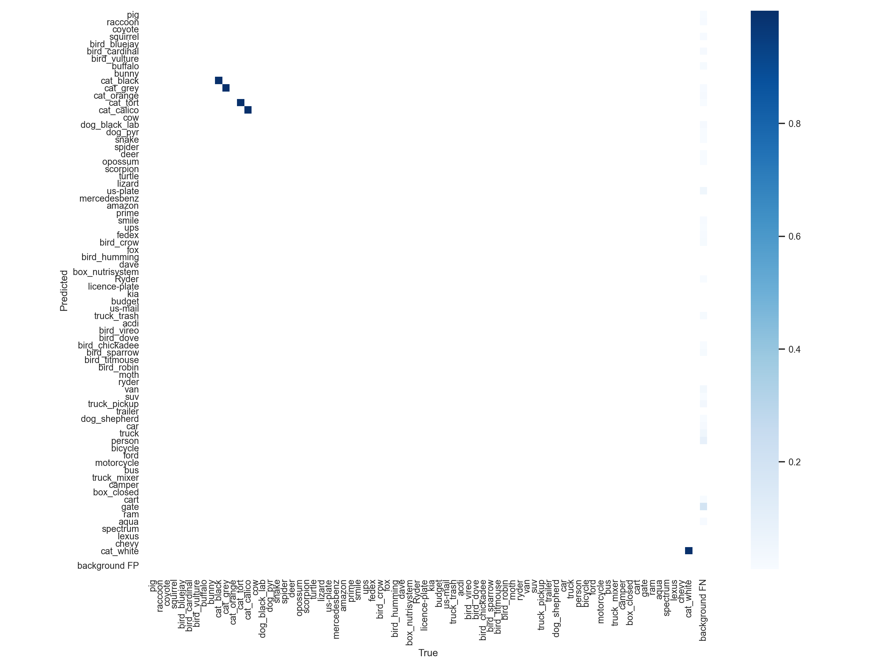
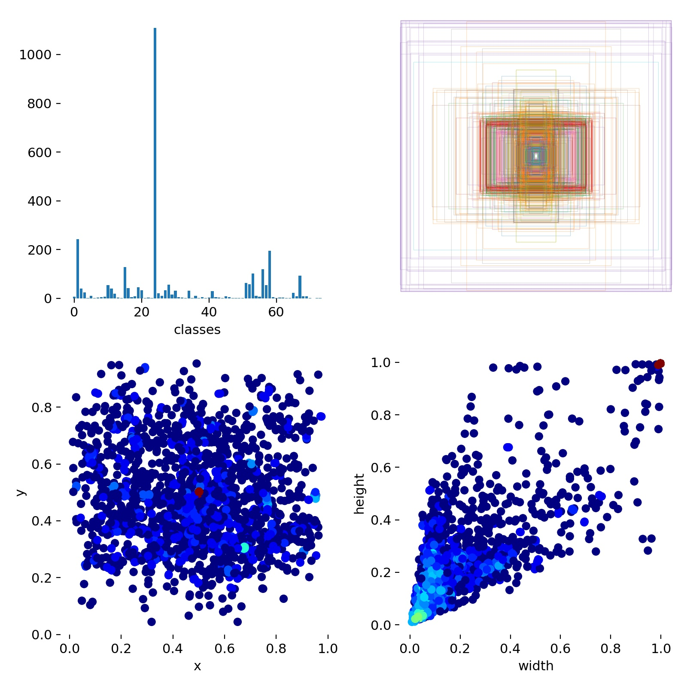
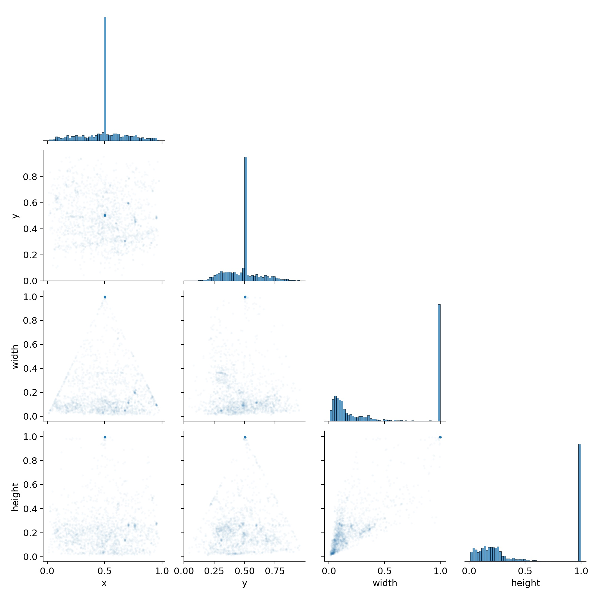

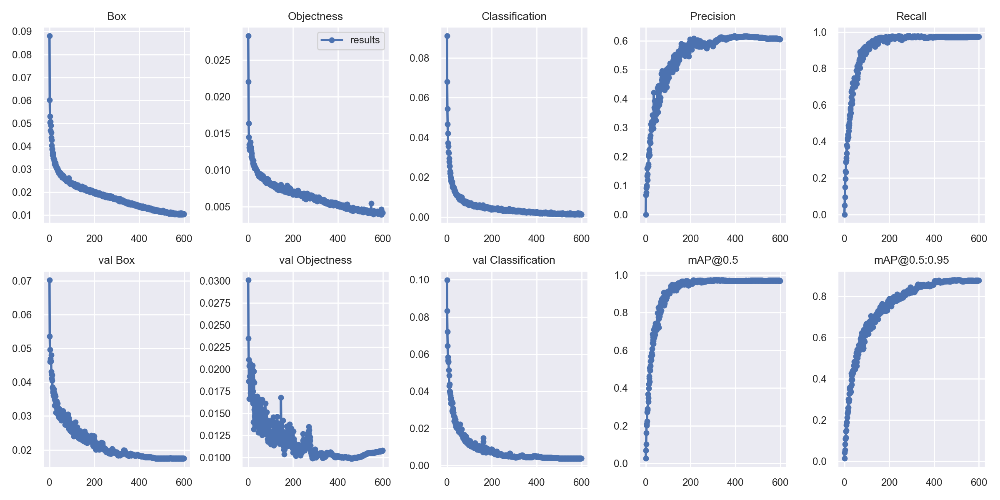
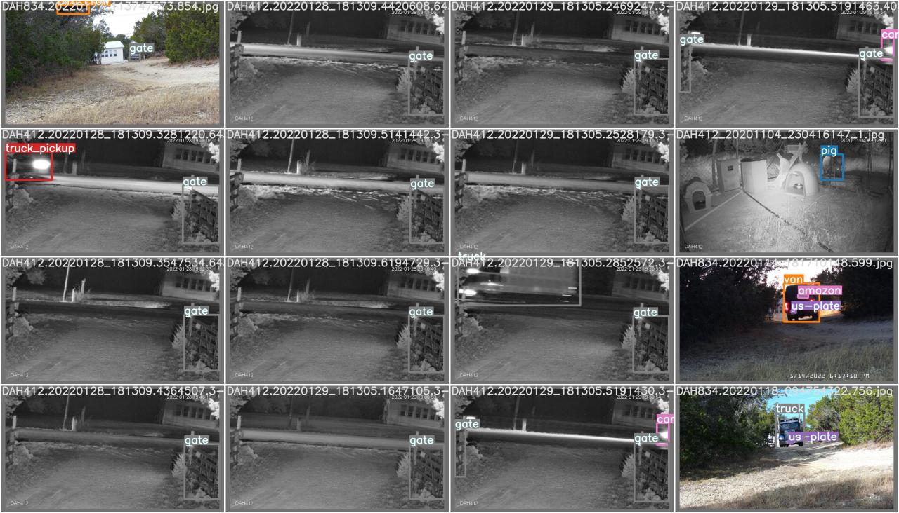


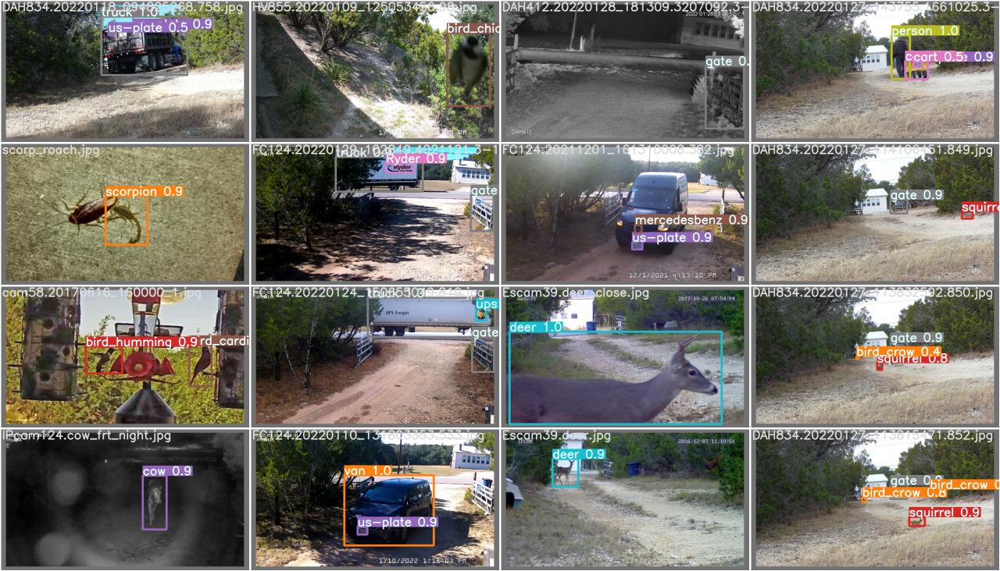
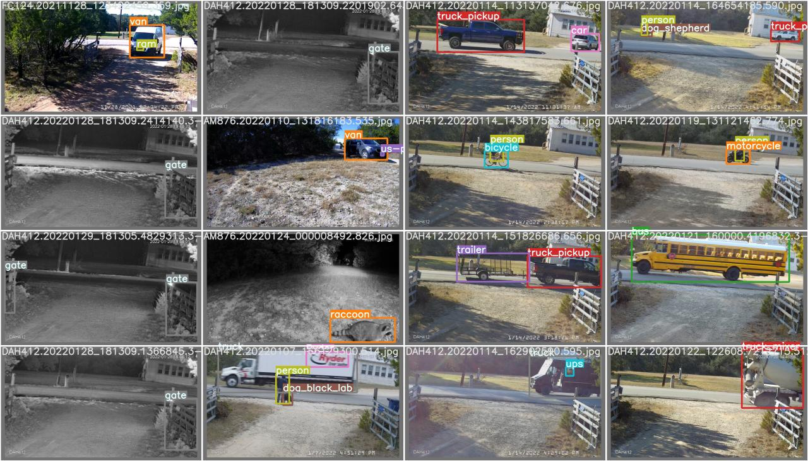
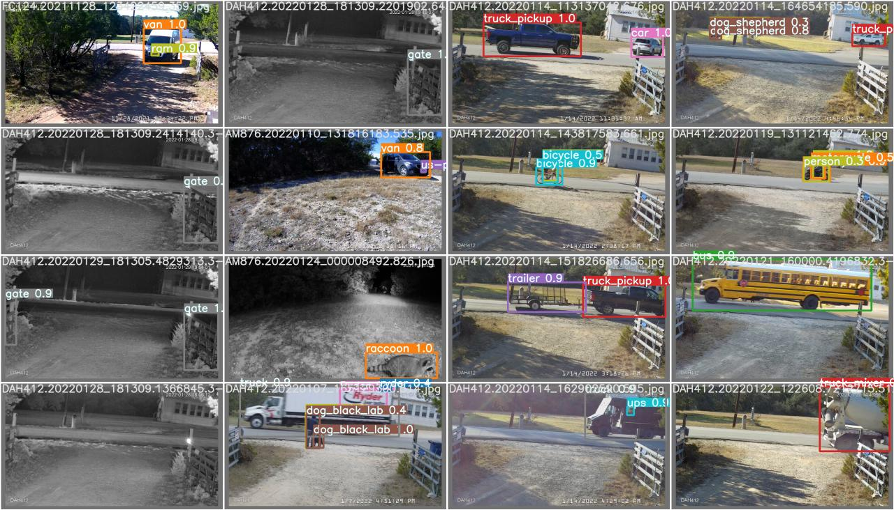
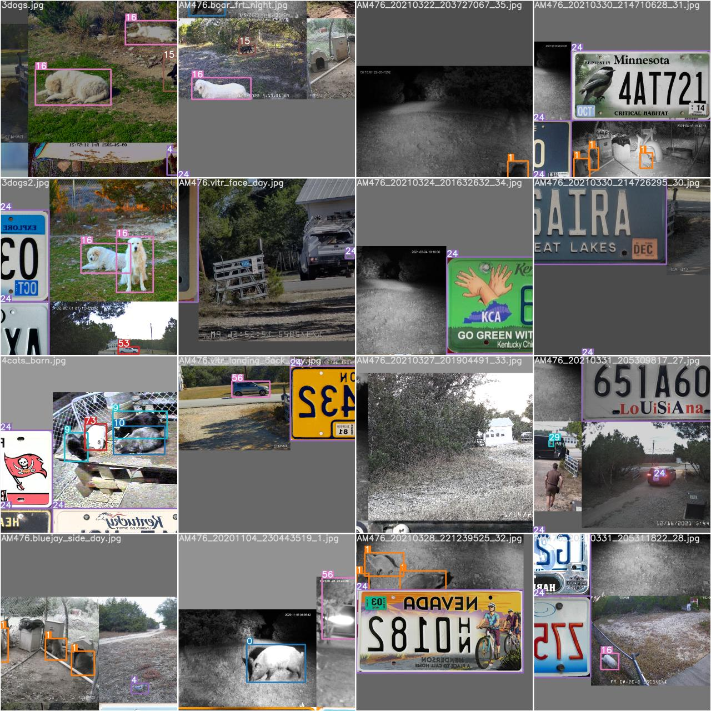
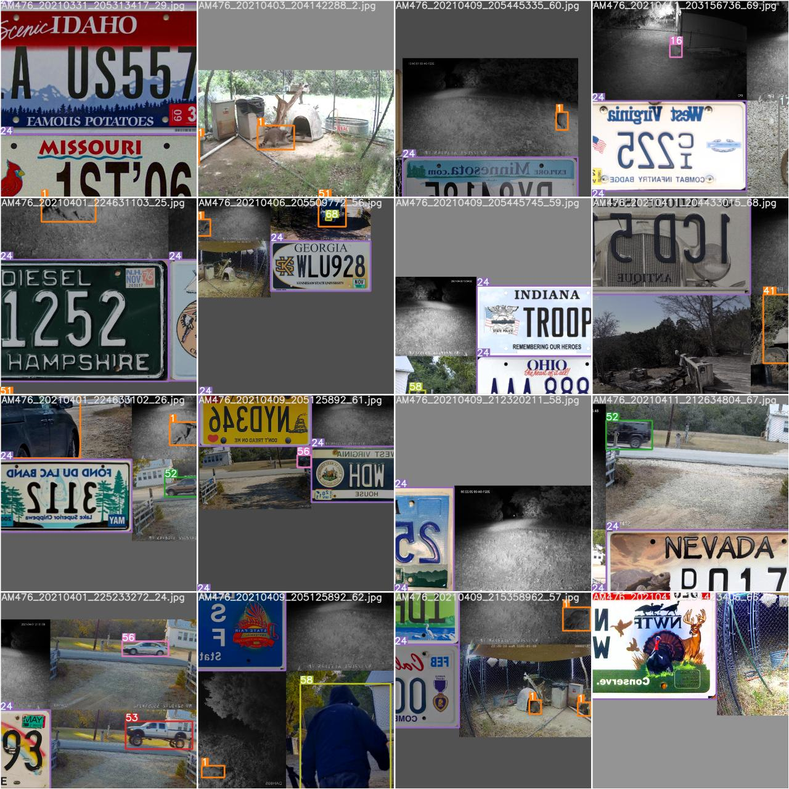
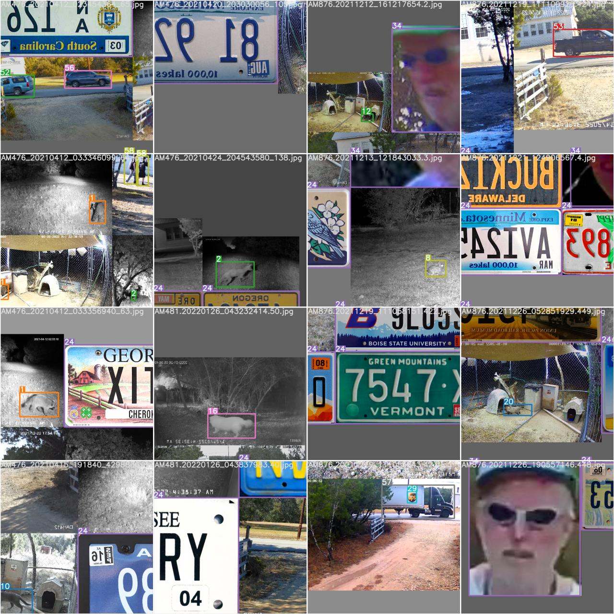
